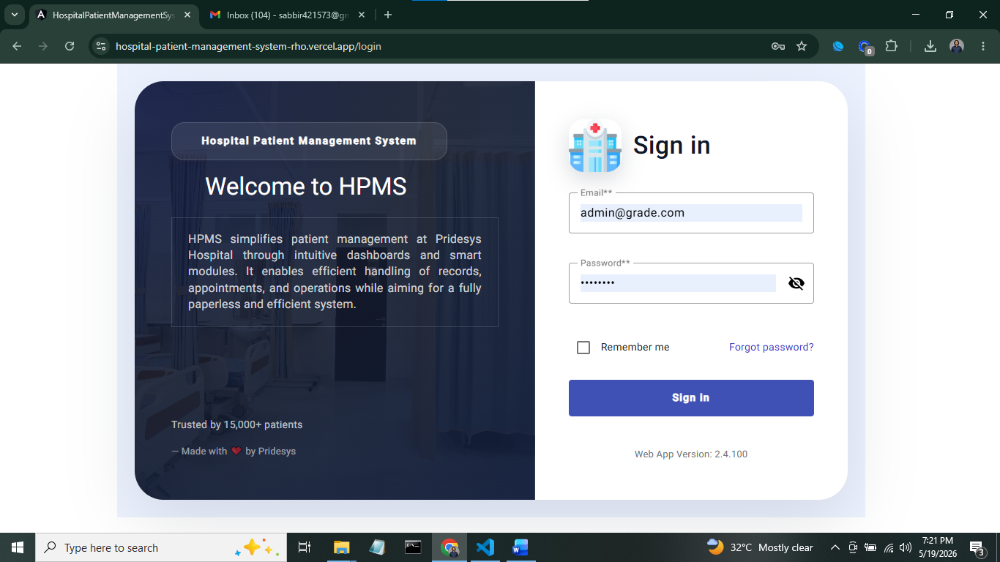
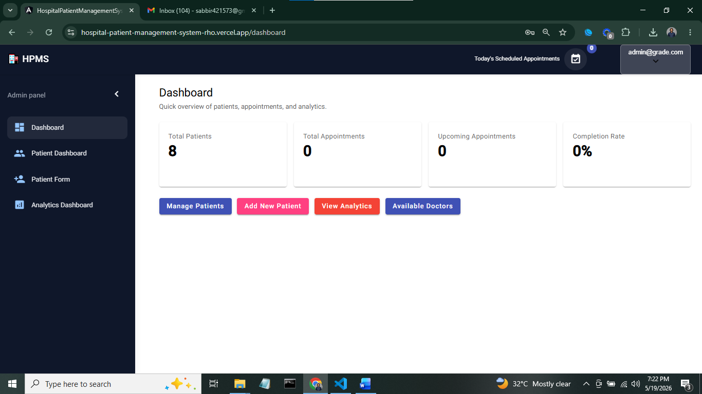
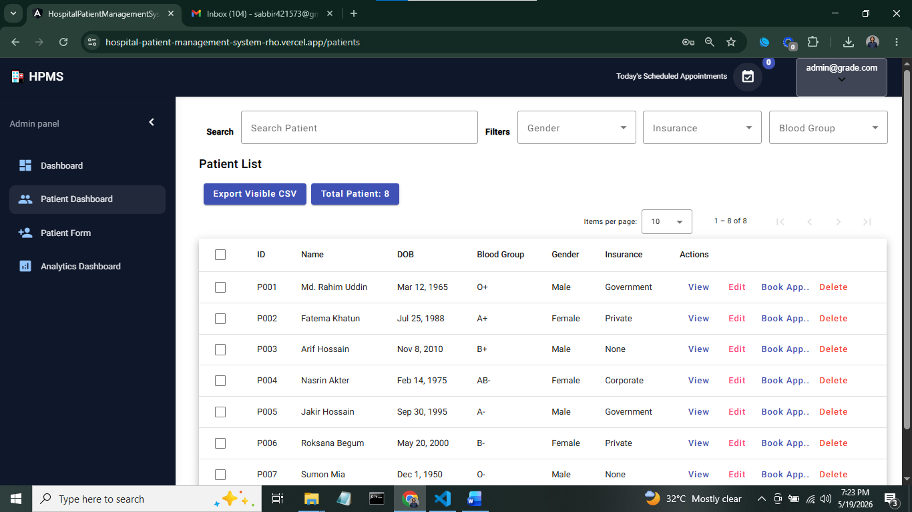
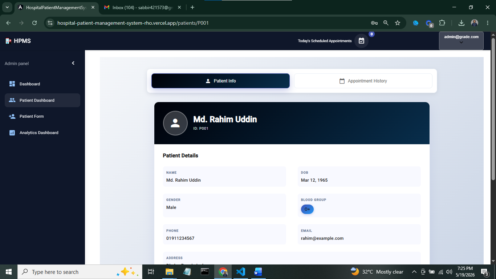
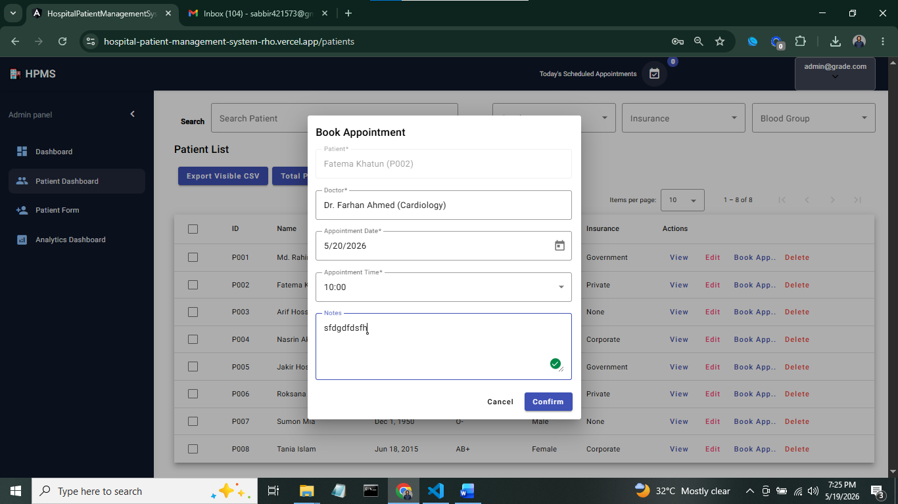
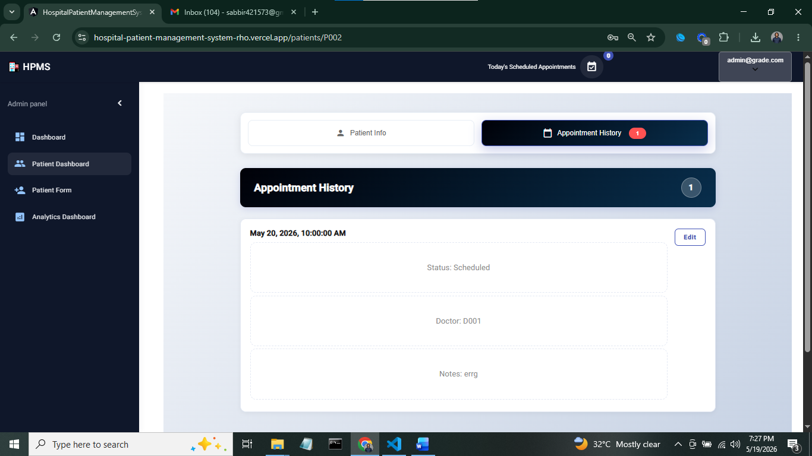
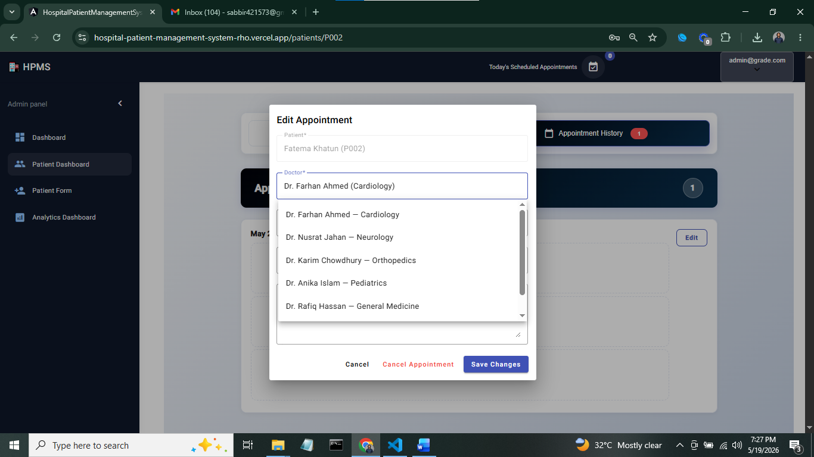
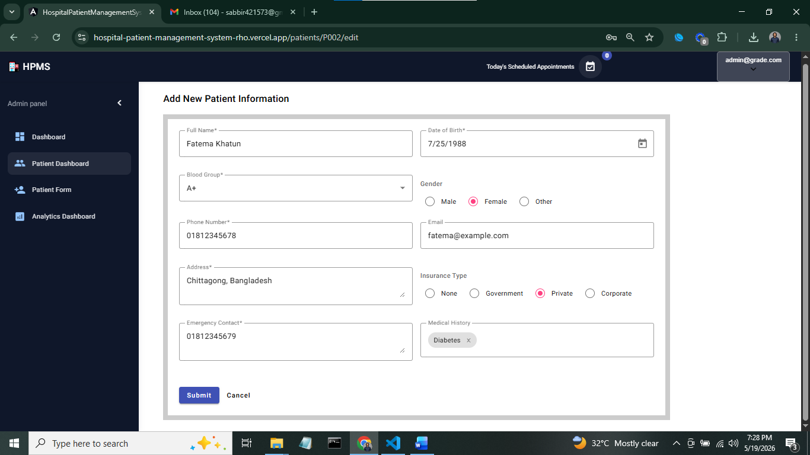
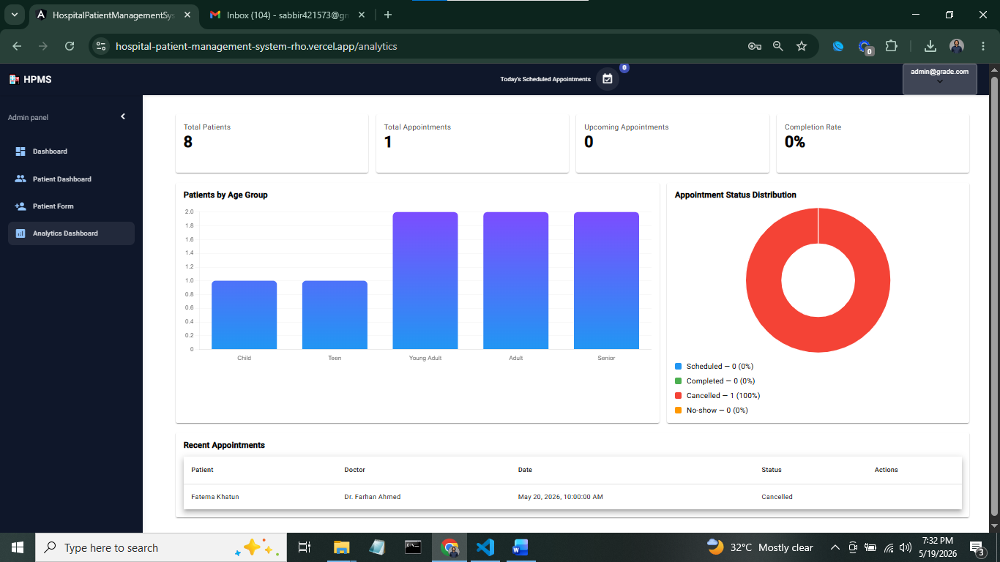

# 🏥 Hospital Patient Management System

A comprehensive Angular-based web application designed to streamline hospital operations by managing patient information, appointments, and medical records efficiently.

## ✨ Features

### 👤 Patient Management

- Create, read, update, and delete patient records
- Store comprehensive patient information (name, contact, medical history)
- View complete patient dashboard with appointment history
- Quick patient card view for easy reference

### 📅 Appointment System

- Schedule and manage patient appointments
- View appointment history for each patient
- Interactive appointment modal for booking
- Calendar-based appointment tracking
- Appointment analytics and statistics

### 📊 Dashboard & Analytics

- Analytics dashboard with visual charts and statistics
- Patient statistics and appointment metrics
- Real-time data visualization using Chart.js
- Dashboard home with key performance indicators
- Responsive dashboard layout

### 🔐 Authentication & Security

- Login/Authentication module
- Auth guards to protect routes
- User session management
- Secure access to patient data

### 🎨 User Interface

- Material Design components (Angular Material)
- Responsive sidebar navigation
- Navbar with user controls
- Toast notifications for user feedback
- Organized shared component library
- Clean and intuitive UI/UX

### 📱 Responsive Design

- Mobile-friendly layout
- Tablet and desktop support
- Adaptive navigation

---

## 🛠️ Tech Stack

| Technology           | Version | Purpose                         |
| -------------------- | ------- | ------------------------------- |
| **Angular CLI**      | 15.2.11 | Framework & Build Tool          |
| **Angular Material** | 15.x    | UI Components & Material Design |
| **Chart.js**         | 4.2.1   | Data Visualization              |
| **ng2-charts**       | 4.1.1   | Angular Charts Integration      |
| **NgToastr**         | 15.2.2  | Toast Notifications             |
| **TypeScript**       | Latest  | Language                        |
| **RxJS**             | Latest  | Reactive Programming            |

---

### Step 3: Install Angular Material

```bash
ng add @angular/material
```

### Step 4: Install Additional Dependencies

```bash
npm install ngx-toastr --save
npm install chart.js ng2-charts --save
```

### Run Development Server

```bash
ng serve
```

Navigate to `http://localhost:4200/`

### Build for Production

```bash
npm run build
```

or

```bash
ng build
```

Build artifacts will be stored in the `dist/` directory.

### Deployment

- **Vercel**

---

## 📂 Project Structure

```
src/
├── app/
│   ├── app-routing.module.ts          # Main routing configuration
│   ├── app.component.*                # Root component
│   ├── app.module.ts                  # Root module
│   │
│   ├── core/                          # Core module (singleton services)
│   │   ├── guard/
│   │   │   └── auth-guard.guard.ts    # Route protection
│   │   ├── models/
│   │   │   ├── patient.ts             # Patient model
│   │   │   └── appoinment.ts          # Appointment model
│   │   └── service/
│   │       ├── patient.service.ts     # Patient API service
│   │       └── sidebar.service.ts     # Sidebar state service
│   │
│   ├── features/                      # Feature modules
│   │   ├── auth/
│   │   │   └── login/                 # Login component
│   │   │
│   │   ├── dashboard/
│   │   │   ├── dashboard-home/        # Main dashboard view
│   │   │   ├── analytics-dashboard/   # Analytics & charts
│   │   │   └── patient-dashboard/     # Patient-specific dashboard
│   │   │
│   │   ├── patients/
│   │   │   ├── patient-list/          # List all patients
│   │   │   ├── patient-form/          # Add/Edit patient
│   │   │   ├── patient-info/          # View patient details
│   │   │   ├── patient-card/          # Patient card component
│   │   │   └── appointment-history/   # Patient appointments
│   │   │
│   │   ├── Appointment/
│   │   │   └── appointment-modal/     # Appointment booking modal
│   │   │
│   │   └── features.module.ts         # Features module definition
│   │
│   └── shared/                        # Shared components & modules
│       ├── material/
│       │   └── material.module.ts     # Material imports
│       ├── navbar/                    # Top navigation bar
│       ├── sidebar/                   # Side navigation menu
│       └── patient-card/              # Reusable patient card
│
├── assets/                            # Static assets
├── styles.css                         # Global styles
└── index.html                         # Main HTML file
```

---

## 📚 Additional Resources

- [Angular Documentation](https://angular.io/docs)
- [Angular CLI Reference](https://angular.io/cli)
- [Angular Material](https://material.angular.io/)
- [Chart.js Documentation](https://www.chartjs.org/)
- [ngx-toastr](https://www.npmjs.com/package/ngx-toastr)

---ScreenShots










